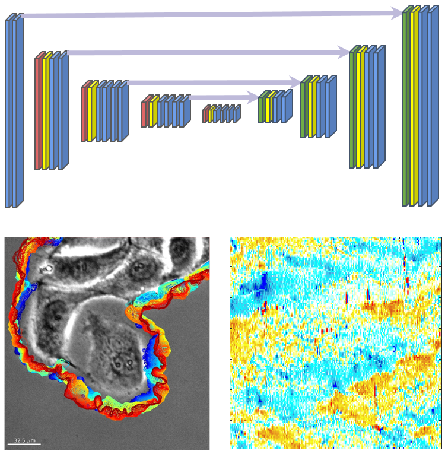

# MARS-Net 
 

**Deep learning-based segmentation pipeline for profiling cellular morphodynamics from multiple types of live cell microscope**  
by Junbong Jang, Chuangqi Wang, Xitong Zhang, Hee June Choi, Xiang Pan, Bolun Lin, Yudong Yu, Carly Whittle, Madison Ryan, Yenyu Chen, Kwonmoo Lee

To learn more about MARS-Net, please read the [paper](https://www.biorxiv.org/content/10.1101/191858v3)

  

  

## Run Demo
You can quickly segment one of our live cell movie in this demo (Estimated Time: 12 minutes)  
 
<!-- end of the list -->
This demo allows users to see the segmentation performance of MARS-Net and U-Net which are already trained on our live cell movies.
To test MARS-Net pipeline from the scratch in a user's local machine, the user needs to satisfy software requirements and train the models before segmenting movies.  

## Software Requirements
MARS-Net pipeline has been tested on Ubuntu 16.04 with anaconda v4.5.11 and Python v3.6

* For evaluation and visualization, we used
    * MATLAB 2019b
    * To read npy files generated from Python, [NPY Reader](https://github.com/kwikteam/npy-matlab)
    * To calculate F1, precision and recall, [Correspondence Algorithm](https://github.com/davidstutz/extended-berkeley-segmentation-benchmark) developed by University of California Berkeley Segmentation Benchmark
* For Morphodynamics Profiling, we used
    * [Windowing and Protrusion package](https://github.com/DanuserLab/Windowing-Protrusion) developed by Gaudenz Danuser lab (UT Southwestern) for Morphoydynamics profiling.  
* For training the deep learning models and segmenting live cell movies, we used
    * Tensorflow v2.3 on RTX Titan GPU with CUDA 10.1
    * Tensorflow v1.15 on GTX 1080Ti GPU with CUDA 10.0 
* Other Python dependencies in the Anaconda environment are specified in environment.yml

## Pipeline
The pipeline consists of label tool, segmentation modeling, and morphodynamics profiling.    

### Installation
Installation Time can vary based on user's download speed (Estimated Time: 1 hour)  
1. Download MARS-Net pipeline from Github repository and install its software requirements.
1. Setup Anaconda environment
    * conda env create --name marsnet --file environment.yml
    * conda activate marsnet
1. Before running the pipeline, please specify the following parameters in UserParams.py
    * strategy_type (The type of deep learning model. e.g. specialist_unet, or generalist_VGG19_dropout)
    * dataset_folders  (location where your images and mask are stored)
    * img_type  (type of image. default is .png)
    * img_folders  (list of image folder names)
    * mask_folders  (list of mask folder names)
    * frame_list  (list of training frames. e.g. [1,2,6,10,22,34])
    * dataset_names  (list of dataset folder names)
    * model_names  (list of the model names, necessary since multiple models are created from cross validation)
    * REPEAT_MAX  (Max number of times to repeat cross validation. e.g. 1 or 5)
    * Other parameters can be ignored

### Example Data
* phase contrast movie with its labeled mask is in repository's assets folder.  
* single-microscopy-type U-Net and multiple-microscopy-type VGG19D-U-Net trained on 2 frames per movie in leave-one-movie-out cross validation
    * https://drive.google.com/drive/folders/1FLP0D-Y9-DHQmhC-LBZChdUSe6W5zyPw?usp=sharing

### Label Tool
Tool to facilitate labelling raw images semi-automatically

1. To determine hysteresis thresholding for canny detector and kernel size for blurring, run
    * label_tool/explore_edge_extraction_user_params.py
1. Compare results in generated_explore_edge folder
1. To extract edge after choosing hyper parameters, run
    * Python extract_edge.py 
1. Manually Fix the generated edges
    * The generated edges in generated_edge folder, connect fragmented edges and delete the wrong edges
    * We used [ImageJ](https://imagej.nih.gov/ij/download.html) or [GIMP](https://www.gimp.org/) for manual fix after overlaying edge over the original image
1. Post processing to fill the edges
    * python segment_edge.py will save results in generated_segmentation folder

### Deep Learning Model Training and Segmentaion
This section is for training deep learning models from scratch and segmenting the live cell movies 
* Put your live cell movies into the assets folder. Our pipeline assumes leave-one-movie-out cross validation so please provide multiple movies.
* To crop patches, run
    * crop/crop_augment_split.py
* To Train, run
    * models/train_mars.py
* To segment live cell movies, run
    * models/prediction.py

### Evaluation and Visualization
This section is for replicating our evaluation results including bar graphs, line graphs, and violin plots.  

* Edit parameters in evaluation/GlobalConfig.m
    * prediction_path_list
    * display_names
    * frame_list
    * root_path
    * img_root_path
* Download [NPY Reader](https://github.com/kwikteam/npy-matlab) and add the folder to MATLAB path.
* Download [Correspondence Algorithm](https://github.com/davidstutz/extended-berkeley-segmentation-benchmark) and add the folder to MATLAB path.
* Before visualizing the evaluated results, calculate F1, precision and recall from the segmented movies, run
    * evaluation/evaluation_f1/run_overlap_mask_prediction.m
* To draw bar graphs and line graphs across different training frames, run
    * evaluation/evaluation_f1/visualize_across_frames_datasets.m
* To draw edge evolution, run
    * evaluation/evaluation_f1/run_overlap_compare.m
* To draw violin plot, run
    * evaluation/violin_compare.m  

<!-- end of the list -->
Unlike MATLAB code above, learning curves and bubble plots are drawn using Python
* To draw learning curve, run
    * evaluation/draw_learning_curve.py
* To draw bubble plot, run
    * evaluation/bubble_training_curve.ipynb
<!-- end of the list -->

To draw activation maps and replicate SEG-Grad-CAM results, run
* SegGradCAM/main.py

### Morphodynamics Profiling
* For single cell cropping the segmented movie, run
    * rotate_crop_img.py
* Download [Windowing and Protrusion package](https://github.com/DanuserLab/Windowing-Protrusion)
* Add directory and sub directory of the downloaded package to the MATLAB path 
* Type movieSelectorGUI in the command window in MATLAB
* Create new movie and perform windowing on the segmented movie from the previous step.
* For details, refer to [Windowing and Protrusion package](https://github.com/DanuserLab/Windowing-Protrusion) Github page.